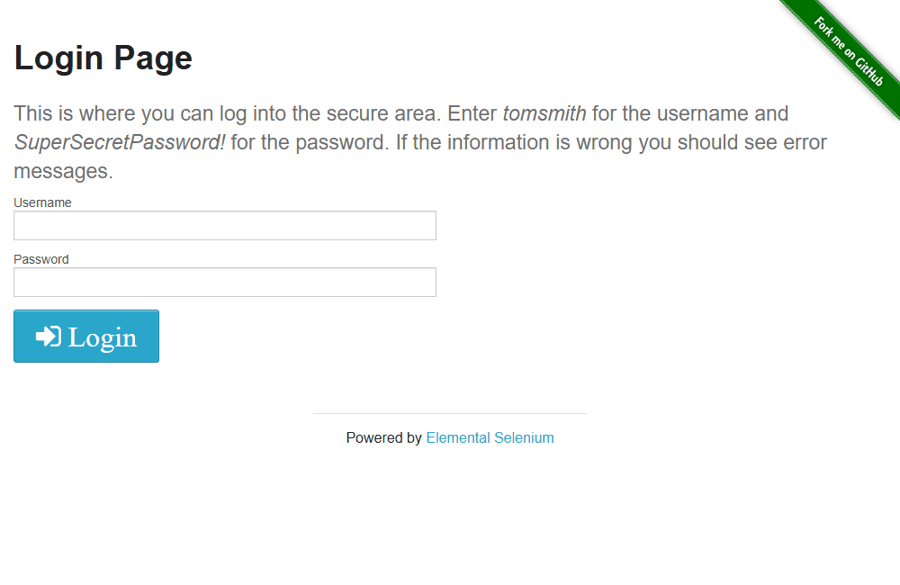
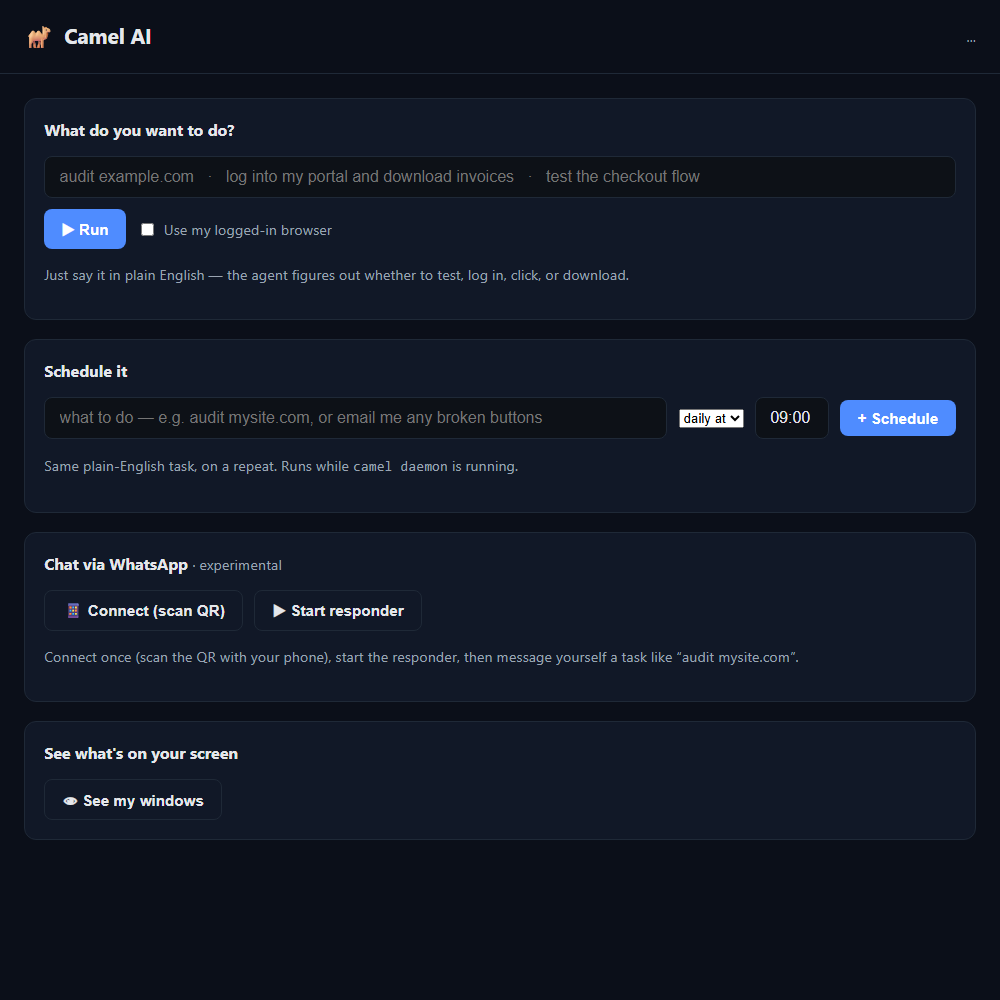
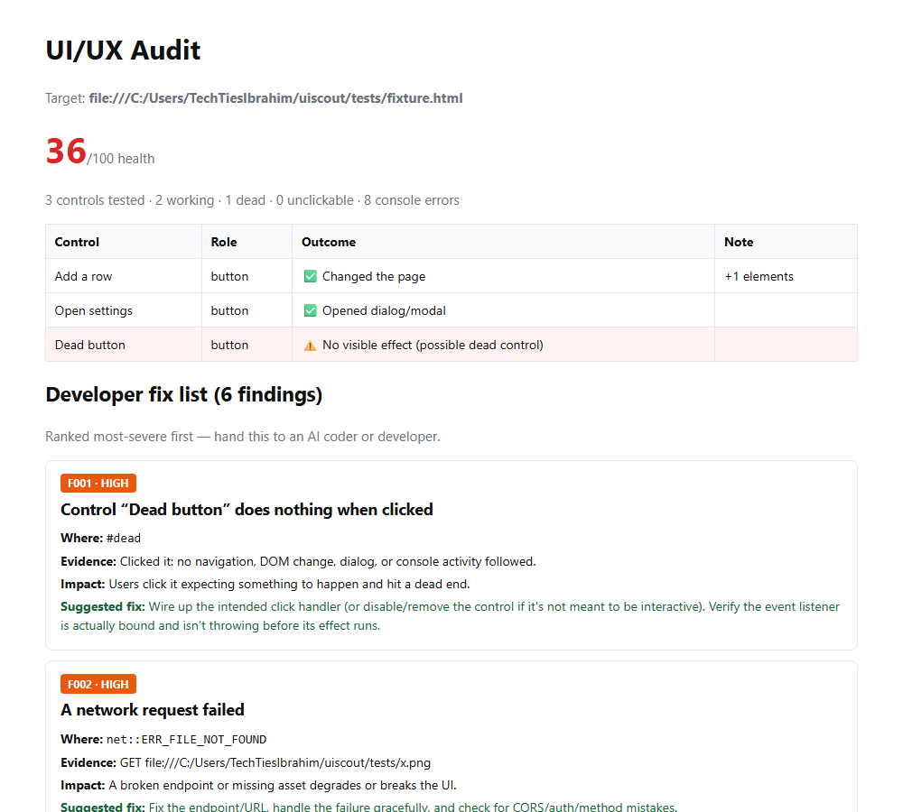

# Camel AI


**Automate and test any software through its real UI — no target-app API needed.**

Camel AI drives software the way a human does: clicking, typing, and reading the
screen. Web apps via Playwright, native Windows apps via UI Automation, and
anything else via vision (screenshot + coordinate clicks). It audits UI/UX
(dead buttons, console errors, broken flows) and automates goal-driven tasks.

**The only API camel ever touches is an LLM API** (the brain — and you can use
a subscription instead). It never needs the *target* software's API, because it
operates the UI directly. That's the point: it works on the software that has no
API, a paywalled API, or one you can't get access to.

Two ways to drive it, sharing one LLM-agnostic core:

1. **MCP server** — plug into Claude Code, Claude Desktop, Cursor, or Windsurf.
   Uses your existing **subscription**. No API key.
2. **Any-LLM agent** — point your own model (OpenAI, Ollama, LM Studio, vLLM,
   Groq, …) at it via a tiny `LLMProvider` interface.

## See it

**It automates a login by itself** (types the credentials, clicks in, lands on the app):



**Enterprise dashboard** (`camel dashboard`) — audit sites, see findings, use your logged-in browser:



**Every run produces a fix-brief** your AI coder can act on:



## Install (one line) + connect a free brain

**Windows**
```powershell
irm https://raw.githubusercontent.com/DilawarShafiq/camel-ai/main/install.ps1 | iex
```
**macOS / Linux**
```bash
curl -fsSL https://raw.githubusercontent.com/DilawarShafiq/camel-ai/main/install.sh | bash
```

The installer sets everything up (Python, the browser engine) and launches a
**setup wizard**. Pick any brain and paste one key — **Gemini, OpenAI, Anthropic
Claude, OpenRouter (hundreds of models), Groq, Mistral, DeepSeek, Together, a
local Ollama model, or any custom OpenAI-compatible endpoint.** The default is
**Gemini's free tier (no credit card)** so it costs nothing out of the box, but
you're never locked to one provider. Then:

```bash
camel dashboard           # enterprise web UI (audit, findings, see your windows)
camel audit https://mysite.com        # a full UI/UX test → HTML report (no brain needed)
camel login https://portal.com        # sign in once; reuse it with --real-browser
camel audit https://portal.com --real-browser   # test the app behind your login
camel run "download this month's invoices"       # AI does a goal
camel jobs add "https://mysite.com" --at 09:00   # schedule it
camel daemon              # run scheduled jobs autonomously
camel see                 # show every open window + a screenshot
camel whatsapp connect    # chat with Camel AI from your phone (experimental)
```

You paste one free API key; you never touch Python or a terminal beyond the
install line. Advanced users can still `pip install "camelai[desktop,vision]"`.

### Enterprise / scaling install (Docker)

For teams, CI, and servers — a reproducible, versioned container (no
build-from-source on each machine):

```bash
docker run -p 8765:8765 ghcr.io/dilawarshafiq/camel-ai:latest        # dashboard
docker run ghcr.io/dilawarshafiq/camel-ai audit https://mysite.com  # one-off audit
```

The image (see `Dockerfile`) ships the browser engine baked in and runs the web,
vision, dashboard, scheduler, and MCP features headless — ideal for CI gates and
scheduled runs. Published to GHCR on every release. *(Native desktop automation
is Windows-only and not in the Linux image.)*

## CLI

```bash
camel audit https://example.com --out report.html   # full web audit → HTML report
camel doctor                                         # check browsers + extras
camel mcp-config                                     # print the MCP client snippet
camel                                                # run the MCP server (stdio)
```

## Goal-driven, multi-agent (inside your MCP host)

Drop `integrations/claude/` into your Claude Code project (`.claude/agents/` and
`.claude/skills/`). Then just say what you want:

> *"Test the checkout flow on localhost:3000 and tell me what breaks."*

The `ui-test` skill plans it and hands execution to the `ui-tester` subagent
(one per flow, in parallel for broad audits). Your **subscription** is the brain —
no API key. The run is visible and pauses for you on 2FA/login.

## Use as an MCP server (subscription users, no API key)

Add to your MCP client config (Claude Desktop / Cursor / Claude Code):

```json
{
  "mcpServers": {
    "camel": { "command": "camel" }
  }
}
```

Then ask your AI: *"Open http://localhost:3000 and audit every button."*
Set `CAMEL_HEADLESS=1` to hide the browser window.

### Tools exposed
- `open_page(url)` — navigate
- `snapshot()` — title, url, every visible interactive element + selector
- `click(target)` / `type_text(target, text)` — target by CSS selector **or plain
  visible text** (e.g. `click("Sign in")`); real controls win over stray text
- `audit_interactivity(max_elements)` — clicks everything, flags dead controls,
  navigations, dialogs, DOM changes, console errors (resets to a clean state
  before each control so verdicts don't contaminate each other)
- `check_accessibility()` — images without alt, unnamed buttons/links, unlabeled
  fields, missing page title/lang, duplicate ids (no external library)
- `get_console_errors()` — JS errors, page errors, failed requests
- `screenshot()` — full-page PNG path
- plus `desktop_*`, `vision_*`, and `wait_for_login` (see below)

### Tests
`pip install -e ".[dev]" && pytest` — offline suite over the report logic and the
interactivity/accessibility classification (against a local HTML fixture).

## Use with your own LLM (any model)

```python
import asyncio
from camel.agent import run_audit, OpenAICompatibleProvider

# Local Ollama — no API key
prov = OpenAICompatibleProvider(model="llama3.1",
                                base_url="http://localhost:11434/v1")
print(asyncio.run(run_audit(prov, "Audit every button on http://localhost:3000")))
```

Any LLM works — implement `LLMProvider.chat(messages, tools) -> message`.

## Supported systems (one universal package, auto-detected)

camel is **pure Python** — one wheel (`py3-none-any`) runs everywhere. The
installer/pip **auto-detects the OS and CPU** and pulls the right pieces; you
never choose a build. Per-OS desktop drivers install themselves via environment
markers (Windows→uiautomation, macOS→atomacos, Linux→pyatspi).

| System | Web + vision | Native desktop | Notes |
|---|---|---|---|
| Windows 10/11 (64-bit, x64/ARM64) | ✅ | ✅ UIA | 32-bit unsupported (browser engine needs 64-bit) |
| macOS 12+ (Intel & Apple Silicon) | ✅ | ⚠️ AX (experimental) | grant Accessibility permission |
| Linux (glibc; x86_64 & ARM64) | ✅ | ⚠️ AT-SPI (experimental) | needs AT-SPI packages |

Requires **Python 3.10+**. `camel doctor` reports your platform and what's
ready. (macOS/Linux native desktop drivers are written but not yet CI-verified.)

## Testing → a fix brief for an AI coder

The point of the testing side isn't a report a human skims — it's a **structured
hand-off another AI/developer can act on** to repair the app. Every run produces
a **fix brief** (`schema: camel.fixbrief/v1`): ranked findings, each with a
`location`, the `evidence` observed, the user `impact`, and a concrete
`suggested_fix`. Duplicate issues are collapsed with an occurrence count.

```bash
camel audit https://mysite.com --out report.html --fix-brief fixes.json
```

Then hand `fixes.json` to Claude Code / any coding agent — or pull it live via
the `fix_brief` MCP tool — and it fixes the app into a logical, non-broken
product. Works across any industry app (medical billing, financial, marketing…)
that runs in a browser, on any OS.

## Three drivers — web, desktop, anything

Install the extras you need:

```bash
pip install 'camelai[desktop,vision]'      # Windows desktop + universal fallback
```

| Driver | Reaches | How it "sees" | Reliability |
|--------|---------|---------------|-------------|
| **Web** (`browser.py`) | Websites / web apps | DOM + a11y tree (Playwright) | High |
| **Desktop** (`desktop.py`) | Native Windows apps | UI Automation control tree | Good |
| **Vision** (`vision.py`) | *Anything on screen* | Screenshot → LLM picks coords | Fallback |

Strategy: try Web/Desktop first (structured, fast, precise); drop to Vision only
when there's no accessibility info to read.

### Human-in-the-loop (2FA / CAPTCHA / login) — no API

`wait_for_login(message, until_url_contains=..., until_selector=...)` **pauses**
the automation, lets *you* finish the sensitive step in the visible browser, and
**resumes automatically** the moment it detects success. The automation never
touches your 2FA code. An optional `Notifier` (e.g. WhatsApp) can ping you that a
handoff is waiting.

## Architecture

```
        goal (natural language) ──► MCP host (subscription = brain, multi-agent)
                                          │ calls camel MCP tools
   ┌───────────────┬──────────────────────┼───────────────┬────────────────┐
   Web driver     Desktop driver        Vision driver   Human-handoff    Notifier
  (Playwright)   (Windows UIA)      (screenshot+click)   (2FA/CAPTCHA)  (WhatsApp…)
        └──────────────┴───────── shared core, one interface ─────────────────┘

Frontends:  server.py (MCP → subscription, no API key)
            agent.py  (any LLM → OpenAI-compatible / local Ollama)
```
